# Plugin viessmann pour Jeedom

    Ce plugin permet de récupérer les informations de votre chaudière Viessmann connectée avec VitoConnect, 
    cette récupération de données s'effectue par le biais des API Viessmann écrite par thetrueavatar.

    Le nombre d'appels au service Viessmann est limité à 1450, le dépassement de cette limite est 
    sanctionnée par un bannissement d'une journée. J'ai donc volontairement choisi de ne pas implémenter 
    complètement le Cron à la minute et de n'effectuer la récupération des données que toutes les minutes paires.

## 1. Configuration du plugin

    Rien de particulier dans la configuration de ce plugin, vous pouvez choisir le cron qui vous convient le mieux
    pour la cyclique de récupération des données. Une action "Rafraichir" vous permettra de récupérer les données 
    à la demande.

## 2. Configuration de l'équipement

    Pour l'accès au serveur Viessmann, le nom d'utilisateur et le mot de passe doivent être spécifiés 
    dans les paramètres. Les Ids d'installation et du gateway peuvent être introduits mais ils seront de 
    toute façon récupérés et stockés lors de la première récupération des données sur le serveur.

    On peut introduire l'id du device et l'id du circuit, par défaut une valeur nulle est utilisée par le plugin.
    Les personnes qui auraient deux circuits de chauffage peuvent créer deux équipements avec un id de circuit différent.

    Pour utiliser l'option 'Log Possibilités', vous devez indiquer la valeur Oui ( en respectant la majuscule ) dans la
    zone texte correspondante et passer le log du plugin en mode debug, à la prochaine récupération de données
    toutes les données remontées seront loggées.

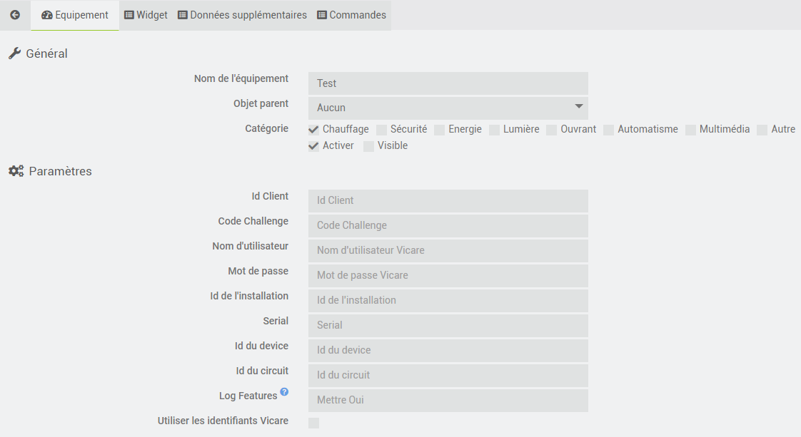

    Pour ce qui est de la configuration du widget, vous avez les choix suivants
        Indiquer le nom du circuit de chauffage qui sera repris sur le widget
        Indiquer l'unité choisie pour l'affichage dans le widget, dans l'exemple la chaudière remonte l'information
            en m3, l'unité est gardée et le facteur de conversion est donc de 1. On pourrait faire le choix des kWh
            et indiquer le facteur de conversion qui permet de passer des m3 aux kWh.
        Utiliser le widget fourni par le plugin ou le widget standard de jeedom
        Afficher ou non la tuile gaz
        Afficher on non la tuile électricité
    
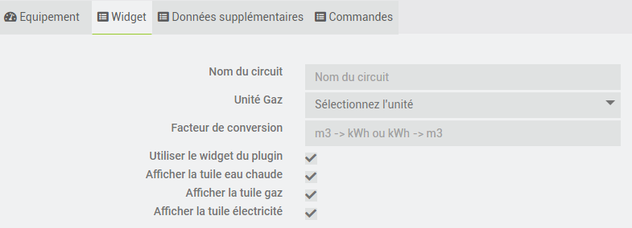

    Si les données température intérieure et/ou extérieure ne sont pas disponibles sur votre chaudière, il est possible 
    d'introduire une commande info d'un équipement extérieur.

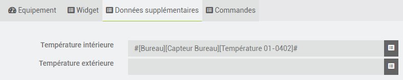
        
## 3. Widget

    Le plugin dispose de son propre widget qui permet la consultation des informations récupérées 
    sur le serveur. Les différentes icones présentes sur le widget permettent l'accès aux différentes 
    informations.

## 3.1 Résumé

    La tuile affichée par défaut présente un résumé des informations de la chaudière, cette tuile se divise en plusieurs
    pavés

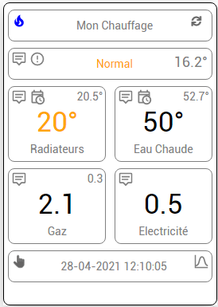

## 3.1.1 Pavé titre

        Il affiche le nom de l'équipement, une petite icone bleue qui s'affiche lorque le brûleur est en fonctionnement
        et une icone en forme de flêche arrondie qui permet de lancer la récupération des données sur le serveur 
        Viessmann et le rafraichissement des données.

## 3.1.2 Pavé chaudière

        Il affiche le programme en cours ainsi que la température extérieure si elle est disponible.

        Une icone permet l'affichage des informations chaudière

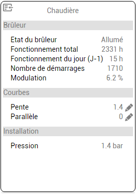

            On y retrouve les informations brûleur, les courbes ( pente et parallèle modifiables dans le widget ) 
            et la pression d'eau de l'installation.

        Une icone permet l'affichage des informations d'entretien

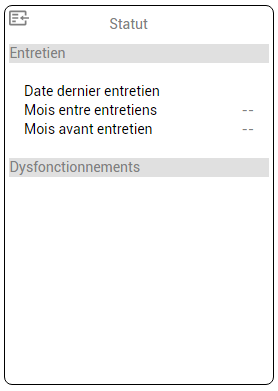

            On y retrouve les informations d'entretien ainsi que les dysfonctionnements éventuels.        

## 3.1.3 Pavé circuit de chauffage

        Il affiche le nom du circuit de chauffage, la température de consigne en fonction du programme choisi,
        la couleur de cette consigne passe du rouge pour le programme confort, à l'orange pour le programme normal,
        au bleu pour le programme réduit ou éco et en noir dans les autres cas.

        Il affiche la température intérieure si elle est disponible.

        Une icone permet l'affichage des informations circuit de chauffage

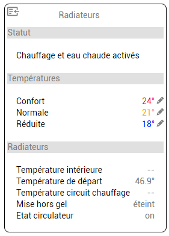

            On y retrouve, le statut de la chaudière
            Les consignes de température modifiables sur le widget
            Les températures intérieure, de départ et du circuit de chauffage
            Le staut "Mise hors gel" et l'état du circulateur

        Une icone permet l'affichage des informations de programmation du chauffage sous forme graphique

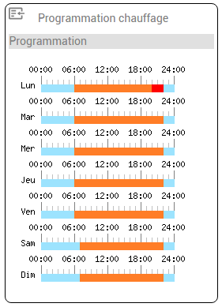

## 3.1.4 Pavé eau chaude

        Il affiche la consigne et la température actuelle de l'eau sanitaire.

        Une icone permet l'affichage des informations eau chaude
        
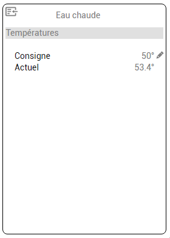

            On y retrouve la consigne et la température actuelle

        Une icone permet l'affichage des informations de programmation eau sanitaire

## 3.1.5 Pavé gaz

        Il affiche la consommation gaz du jour, consommation chauffage et eau sanitaire

        Une icone permet l'affichage du graphique de consommation

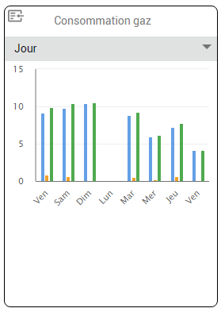

            Un menu déroulant permet de basculer entre les consommations jour, semaine, mois et année.

## 3.1.6 Pavé électricité

        Il affiche la consommation électricité du jour.

        Une icone permet l'affichage du graphique de consommation

## 3.1.7 Pavé manuel

        Il affiche la date de la dernière récupération des données sur le serveur Viessmann

        Une icone permet l'accès aux commandes manuelles 

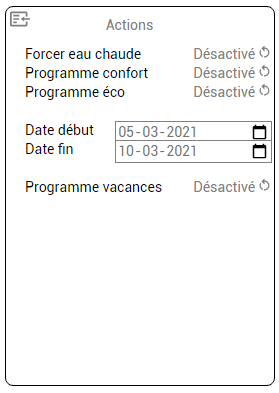

            On retrouve le forçage eau chaude, programme confort, programme éco et programme vacances

            Notez bien qu'en fonction de la chaudière, certaines options pourraient ne pas être disponibles.

## 3.1.8 Pavé courbe

        Il affiche deux courbes

            Le suivi des températures intérieure et de consigne en fonction de la température extérieure
            La courbe de chauffe

        Une icone permet de réinitialiser les mesures température intérieure et de consigne

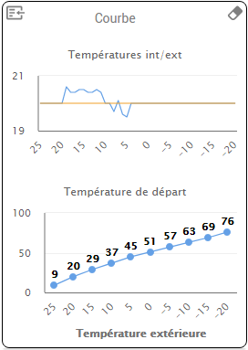

# 4. Historisation

    Les consommations journalières gaz chauffage, gaz eau sanitaire, électricité et heures de fonctionnement journalier
    du brûleur sont archivées dans Jeedom. 
    Le programme archive après minuit en fonction de la remontée des informations les données de consommation de 
    la veille.

